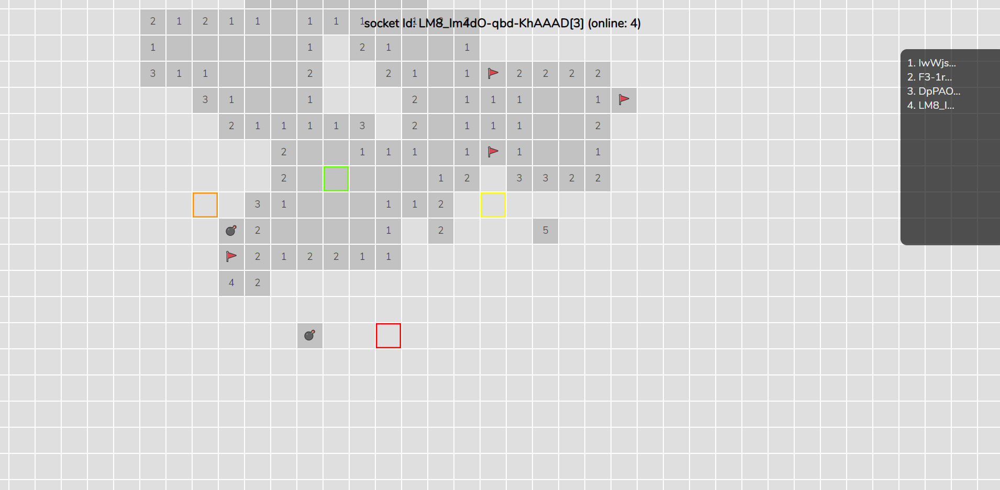

# Socket.IO Collaborative MineSweeper

A simple collaborative MineSweeper for socket.io

## How to use

```
$ npm i && npm start
```

And point your browser to `http://localhost:3000`.
## Features

- You can enjoy MineSweeper with many people.


